Introdução a DMN
===========================

Esse é um laboratório para exercitar conceitos e fundamentos de Bussiness Rules Management System. A regra será desenvolvida utilizando DMN.

## Objetivos

- Criar um projeto.
- Criar uma regra de negócio utilizando DMN.
- Implementar condições.
- Executar a regra via Rest

## Pré requisitos

- Um ambiente RHPAM disponível e funcional.

Premissas do problema
=====================

Este laboratório terá o objetivo de criar uma regra de negócio que avaliará o custo de um seguro de veículo baseado na idade e histórico do aplicante.

- As informações do aplicante será passada para a regra.
- Caso o aplicante tenha uma idade maior do que `25` e não tenha histórico de acidentes, o valor do seguro será de **1000**.
- Caso o aplicante tenha uma idade maior do que `25` e tenha histórico de acidentes, o valor do seguro será de **1250**.
- Caso o aplicante tenha uma idade entre `18` e `25` e não tenha histórico de acidentes, o valor do seguro será de **2000**.
- Caso o aplicante tenha uma idade entre `18` e `25` e tenha histórico de acidentes, o valor do seguro será de **3000**.
- Caso o aplicante tenha uma idade menor do que `18` e independente do histórico de acidentes, o valor do seguro será de **10000**.

Criação do projeto
-------------------

Vamos criar um projeto para a nossa regra de negócio.

1. Dentro de algum **Space** no Business Central clique em **Add Project** para criar um novo projeto.

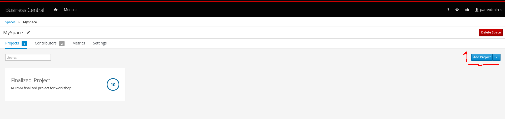

2. No campo **Name** acresente acresente o valor `Introduction_DMN` e clique em **Add** para criar o projeto.

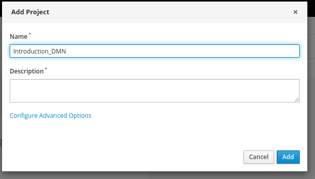

Criação do DMN
-------------------

Vamos criar a regra de negócio.

1. Na página principal do projeto recém criado, clique em **Add Asset** para criar um novo asset.

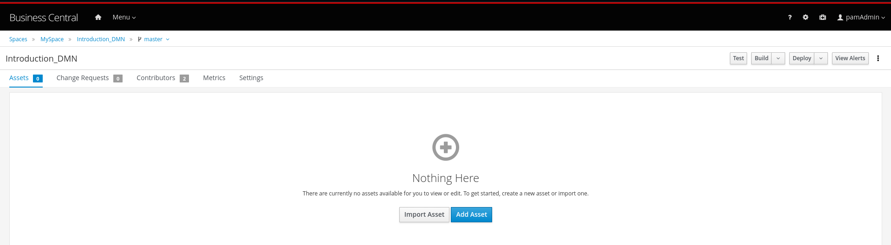

2. Na página de assets disponíveis, localize **DMN**.

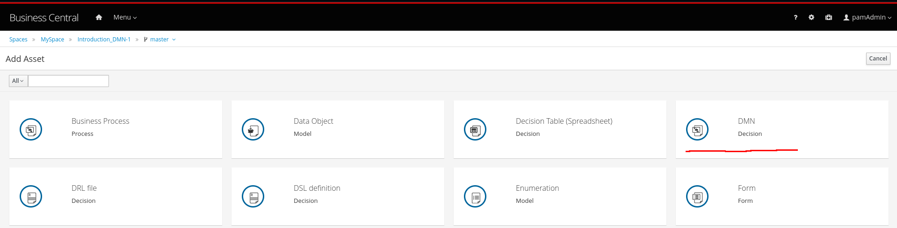

3. No campo **DMN** preencha com `Customer`. Garanta que no campo **Package** esteja a opção `com.myspace.introduction_dmn`. Em seguida clique em **Ok**.

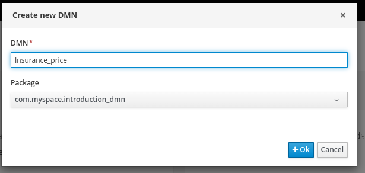

4. Adicione os Input Datas, que representa a entrada de dados na regra. No canvas selecione a primeira opção do menu lateral esquerdo e posicione dois Input Datas no canvas.

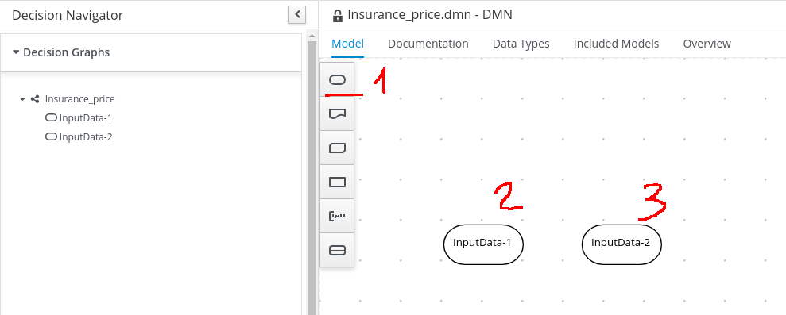

5. Vamos renomear os Input Datas para melhor identificação. Dê um duplo clique em cada Input Data e nomeie como `Age` e `Has previous incidents`. Como mostra a figura a seguir.

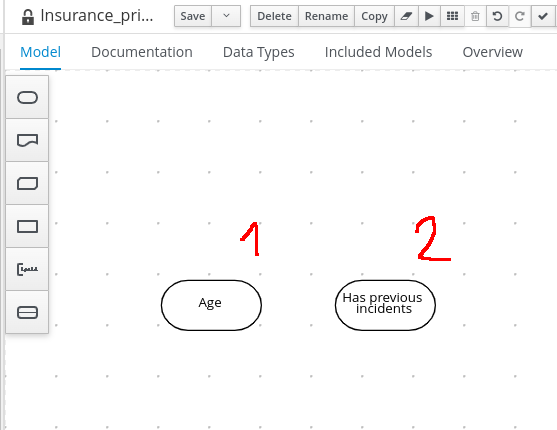

6. Defina o tipo do dado de entrada do primeiro Input Data. Clique no Input Data de nome `Age` e no canto superior direito clique no ícone de lápis, e após isso localize o tópico **Information item** e logo abaixo garanta que no campo **Data Type** o valor seja `number`.

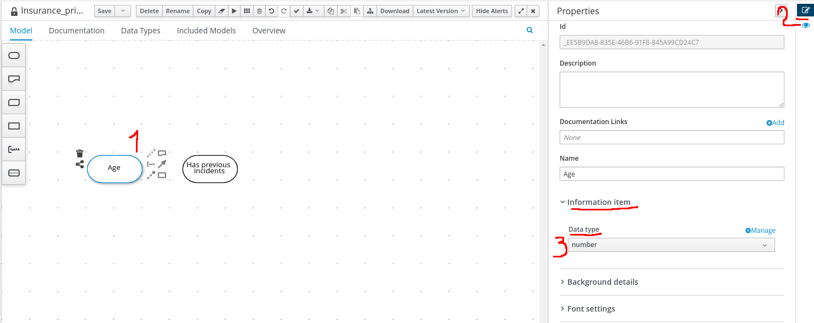

7. Defina o tipo do dado de entrada do primeiro Input Data. Clique no Input Data de nome `Has previous incidents` e no canto superior direito clique no ícone de lápis, e após isso localize o tópico **Information item** e logo abaixo garanta que no campo **Data Type** o valor seja `boolean`.

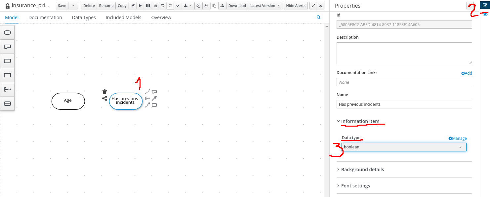

8. Vamos acrescentar o Decision Node, que será responsável por processar e avaliar a decisão. No canvas selecione a quarta opção do menu lateral esquerdo e posicione um decision node logo acima dos dois Input Datas.

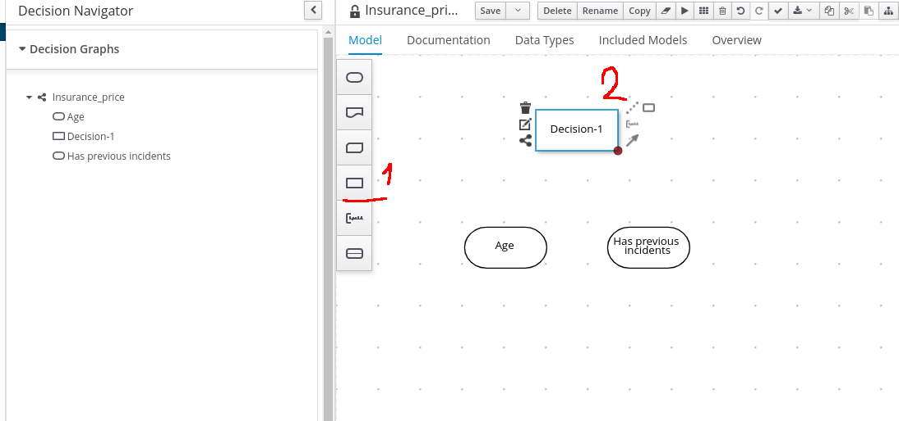

9. Renomeie o Decision Node para melhor identificação. Dê um duplo clique no Decision Node e nomeie como `Insurance Total Price`. Como mostra a figura a seguir.

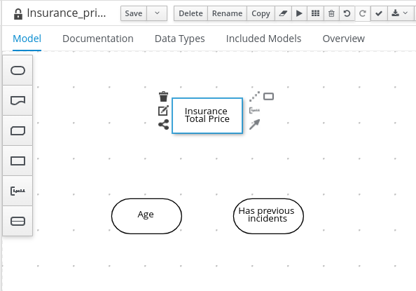

10. Defina o tipo do dado que o resultado da decisão terá. Clique no Decision Node de nome `Insurance Total Price` e no canto superior direito clique no ícone de lápis, e após isso localize o tópico **Information item** e logo abaixo garanta que no campo **Data Type** o valor seja `number`.

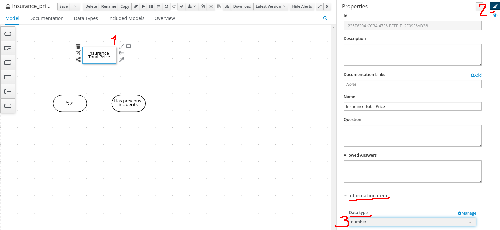

11. Ligue os Inputs Datas ao Decision Node. Clique nos Input Datas e utilizando o ícone de seta contínua ligue-o até o Decision Node, faça o mesmo para o outro Input Data. Conforme imagem a seguir:

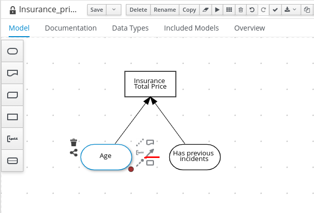

12. Vamos definir as as regras para a decisão. Para isso clique no Decision Node selecione o ícone de lápis abaixo do ícone da lixeira.

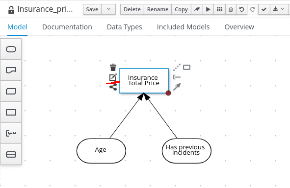

13. Selecione o tipo de lógica da decisão. Clique em **Select expression** e depois em **Decision Table**

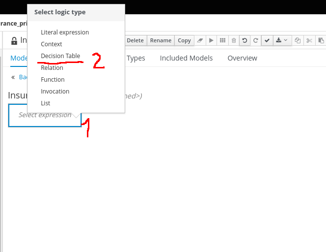

14. Uma decision table em branco será aberta já com os dados de entrada e saída descriminados.

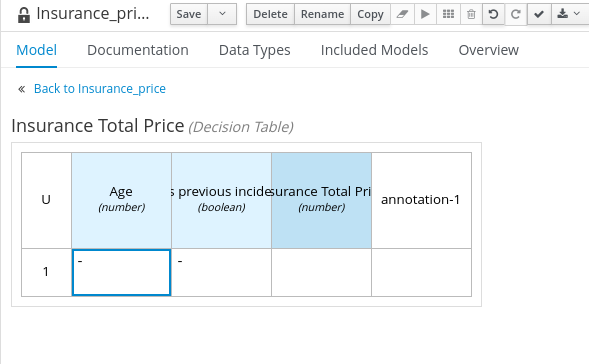

15. Vamos acrescentar as condições da decisão. Preencha a Decision Table conforme a tabela abaixo. Obs: para adicionar uma nova linha clique com o botão direito na linha e selecione **Insert below**. 

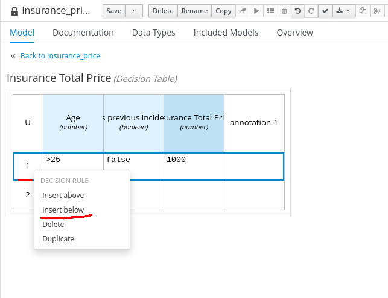

<table>
<colgroup>
<col style="width: 33%" />
<col style="width: 33%" />
<col style="width: 33%" />
</colgroup>
<tbody>
<tr class="odd">
<td><p>Age</p></td>
<td><p>Has previous incidents</p></td>
<td><p>Insurance Total Price</p></td>
</tr>
<tr class="even">
<td><p>>25</p></td>
<td><p>false</p></td>
<td><p>1000</p></td>
</tr>
<tr class="odd">
<td><p>>25</p></td>
<td><p>true</p></td>
<td><p>1250</p></td>
</tr>
</tr>
<tr class="even">
<td><p>[18..25]</p></td>
<td><p>false</p></td>
<td><p>2000</p></td>
</tr>
<tr class="odd">
<td><p>[18..25]</p></td>
<td><p>true</p></td>
<td><p>3000</p></td>
</tr>
<tr class="even">
<td><p><18</p></td>
<td><p>-</p></td>
<td><p>10000</p></td>
</tr>
</tbody>
</table>

* O resultado final da Decision Table será:

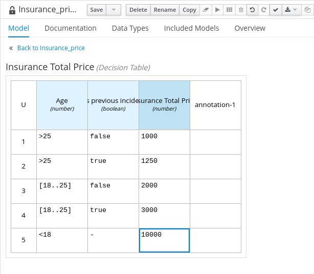

16. Clique em **Back to Insurance_price** para retornar ao canvas.

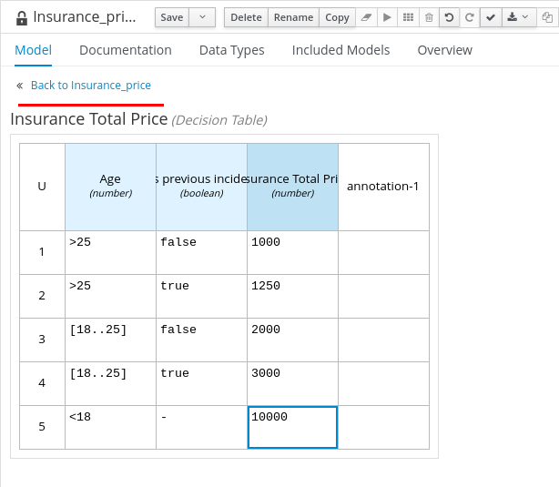

17. Clique em algum lugar em branco do canvas para soltar a seleção do Decision Node, e após isso no canto superior direito clique no ícone de lápis. Localize os campos **Name** e **Namespace** e salve em um bloco de notas os conteúdos desses campos. Eles serão utilizados mais tarde para executar a regra.

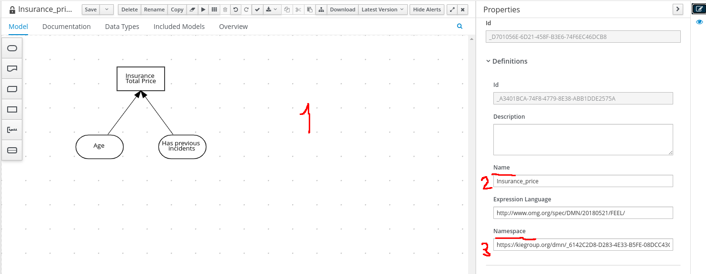

18. Clique em **Save** para salvar o DMN. Após salvar pode sair do asset clicando no ícone X no canto superior direito.

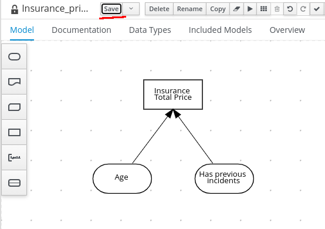

Deploy do Projeto
===============================

Faça o build e deploy do projeto.

### Pré Requisito

- Passo anterior de [Criação da regra](#criação-do-dmn)

1. Na página inicial do projeto clique em **Deploy**.

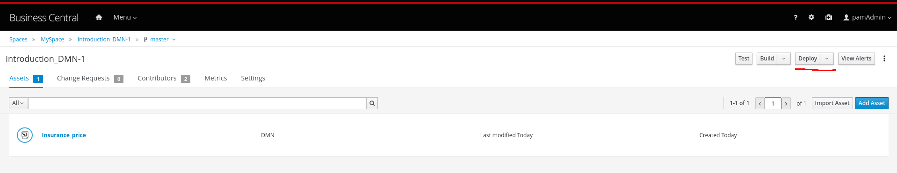

2. A mensagem que espera-se ver é de sucesso:

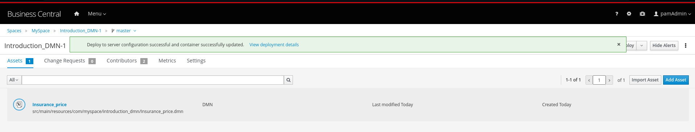

Testar o Projeto
===============================

Para testar apenas uma regra que não esteja inserida em um processo, precisaremos iniciar via Rest. Para isso vamos até o Swagger do **Kie-Server** para executa-la.

1. Caso você esteja fazendo o laboratório com o RHPAM local, abra uma nova página no seu browser no endereço `http://localhost:8080/kie-server/docs`

  * Caso você esteja utilizando o RHPAM no Openshift que está na Cloud. No menu lateral esquedo vá até **Topology** e localize o **Kie-Server** e clique em **Open Url**. Abrirá uma nova aba no seu navegador, acrescente ao final da URL `/docs` para abrir o Swagger.

2. Essa será a visão inicial do Swagger:

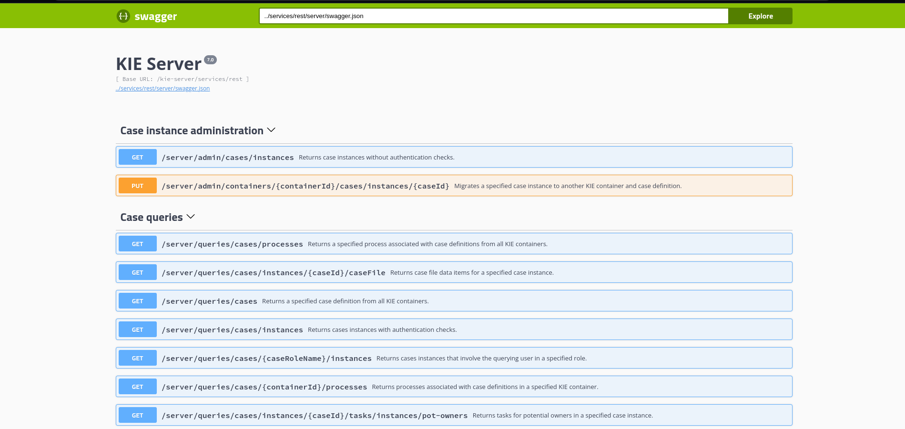

3. Localize o tópico **DMN models** e em seguida clique no endpoint **/server/containers/{containerId}/dmn - sEvaluates decisions for given input**.

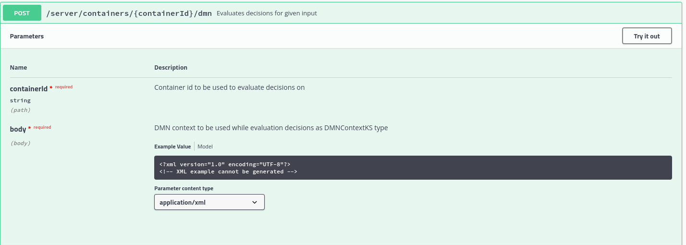

4. Clique em **Try it out**. No campo **containerId** insira o seguinte valor `Introduction_DMN_1.0.0-SNAPSHOT`

* No campo **body** insira o seguinte JSON. 
* OBS: na chave model-namespace, coloque o valor que você salvou do item `17` do [tópico Criação do DMN](#criação-do-dmn)
* Garanta também que o **Content-Type** tanto do Request quanto do Response sejam `application/json`.
* Clique em **Execute** para executar a chamada Rest Via Swagger.

```json
{
  "model-namespace": "<SEU_VALOR_DE_NAMESPACE>",
  "model-name": "Insurance_price",
  "dmn-context": {
    "Age": 30,
    "Has previous incidents": false
  }
}
```

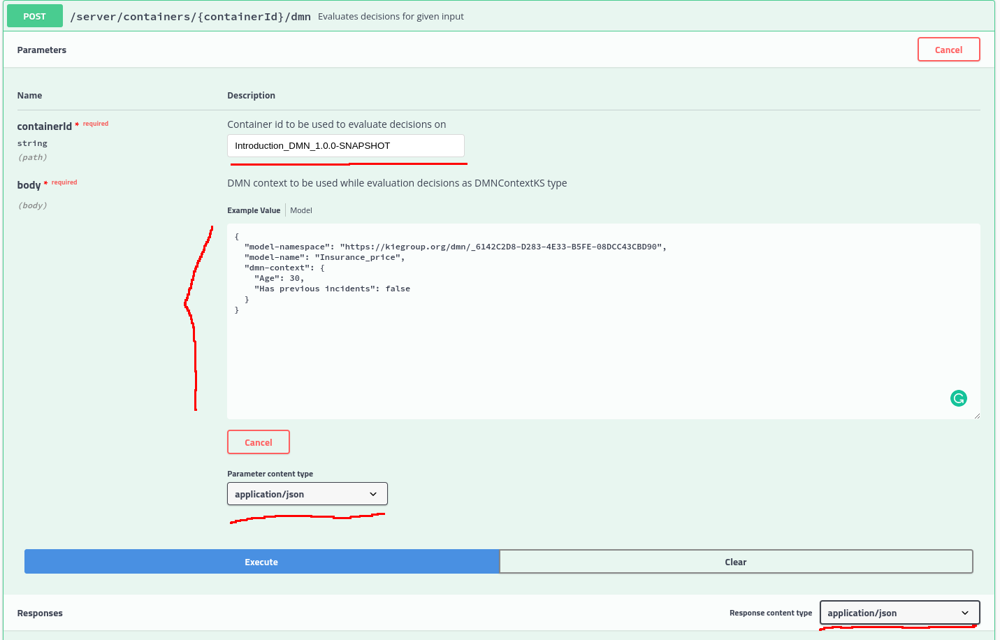

5. Caso aparece um popup solicitando login, utilize o seu login e senha padrão do RHPAM.

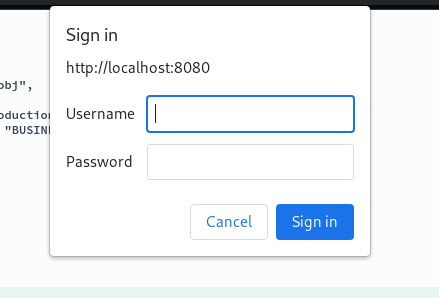

6. O resultado esperado é que o código retorne `200` e na resposta da chamada que você consiga localizar os valores passados para o objeto e a resposta da decisão no atributo `Insurance Total Price`.

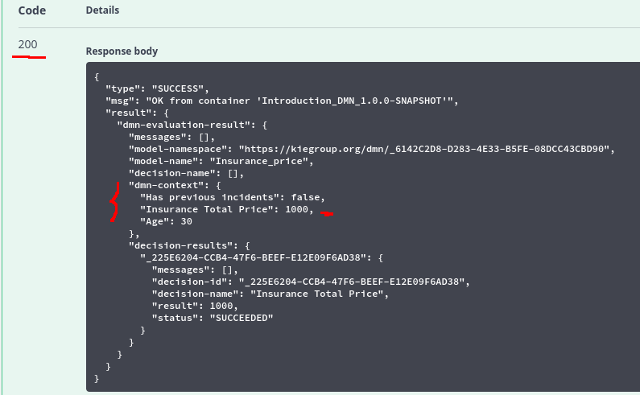

Outros payloads
===============================

Tente novamente porém alterando os valores do JSON no passo de número `4` e verifique o resultado da regra. Lembrando de **alterar** o valor da chave `model-namespace` para o valor do seu projeto.

* Teste 1

```json
{
  "model-namespace": "<SEU_VALOR_DE_NAMESPACE>",
  "model-name": "Insurance_price",
  "dmn-context": {
    "Age": 20,
    "Has previous incidents": false
  }
}
```

* Teste 1

```json
{
  "model-namespace": "<SEU_VALOR_DE_NAMESPACE>",
  "model-name": "Insurance_price",
  "dmn-context": {
    "Age": 20,
    "Has previous incidents": true
  }
}
```

* Teste 1

```json
{
  "model-namespace": "<SEU_VALOR_DE_NAMESPACE>",
  "model-name": "Insurance_price",
  "dmn-context": {
    "Age": 30,
    "Has previous incidents": true
  }
}
```

* Teste 1

```json
{
  "model-namespace": "<SEU_VALOR_DE_NAMESPACE>",
  "model-name": "Insurance_price",
  "dmn-context": {
    "Age": 18,
    "Has previous incidents": false
  }
}
```

Projeto Completo
===============================

Caso queira ver o resultado final, apenas importe esse repositório no **RHPAM** e faça o deploy.